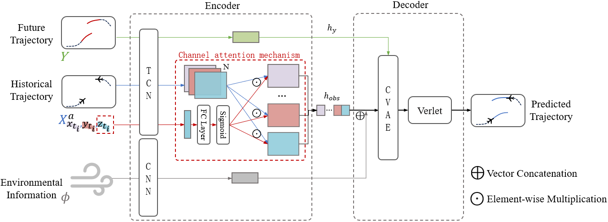

# ACTrajNet

## introduction

This repository provides the source code for the paper **"Altitude-Aware Trajectory Prediction Methods for Non-Towered Terminal Airspace"**, which presents an altitude-aware trajectory prediction approach. The method independently extracts altitude features using a temporal convolutional network (TCN) and employs a channel attention fusion mechanism to dynamically integrate altitude features into different trajectory representation channels. This significantly enhances the model’s ability to capture complex flight patterns in the vertical dimension. The specific structure of the proposed model is as follows:




## Repository Structure

```markdown
dataset
│  7days1_no_social
│  ├─test (Archive for the test data)
│  └─train (Archive for the training data)
│  7days2_no_social
│  ├─test (Archive for the test data)
│  └─train (Archive for the training data)
│  7days3_no_social
│  ├─test (Archive for the test data)
│  └─train (Archive for the training data)
│  7days4_no_social
│  ├─test (Archive for the test data)
│  └─train (Archive for the training data)
├─model
│  CAF_bilstm.py
│  CAF_lstm.py
│  CAF_tcn.py
│  cave_base.py
│  gat_layers.py
│  gat_model.py
│  HCC_bilstm.py
│  HCC_lstm.py
│  HCC_tcn.py
│  lstm_model.py
│  tcn_model.py
│  utils.py
│  VCC_bilstm.py
│  VCC_lstm.py
│  VCC_tcn.py
├─save_models
├─requirements.txt
├─test.py
├─train.py
└─images
```

## Package Requirements

- Python == 3.8.10
- torch == 2.2.2+cu121
- geographiclib==2.0
- metar==1.11.0
- numpy==1.23.5
- pandas==1.5.3
- scipy==1.6.3
- tqdm==4.64.1

# Instructions

## installation

### clone this repository

```shell
git clone https://github.com/zhixiangbaipiao/ACTrajNet.git
```

### Create proper software and hardware environment

You are recommended to create a conda environment with the package requirements mentioned above, and conduct the training and test on the suggested system configurations.

### Training

The training script is provided by `train.py` for the flight trajectory prediction. The arguments for the training process are defined bellow:

To train the ACTrajNet, use the following command, There are three types of `model_arch`: VCC, HCC, and CAF, corresponding to the three different fusion mechanisms mentioned in the article. There are also three types of `model_type`: TCN, BiLSTM, and LSTM, corresponding to the three different altitude feature extractors mentioned in the article. When training the model, it is important to choose the appropriate `model_arch` and `model_type`.

```shell
python train.py --model_arch xxx --model_type xxx
```

### Test

The test script is provided by `test.py` for the evaluation.

To test the model, use the following command.The `epoch` parameter specifies the model checkpoint from a particular training epoch to be loaded for testing. The `model_arch` parameter defines the fusion mechanism, while the `model_type` parameter specifies the altitude feature extractor.

```shell
python test.py --epoch xxx --model_arch xxx --model_type xxx
```

### Dataset

In this repository, the dataset are provided for evaluation. They can be accessed in the /data.The data comes from https://theairlab.org/trajair/. Since this study does not consider aircraft interactions, multiple aircraft in the same TXT file were separated into different TXT files, with each file containing only a single aircraft.

